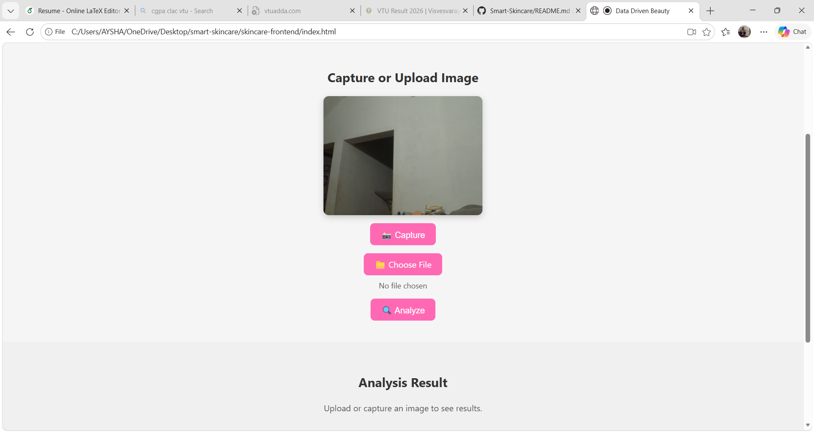
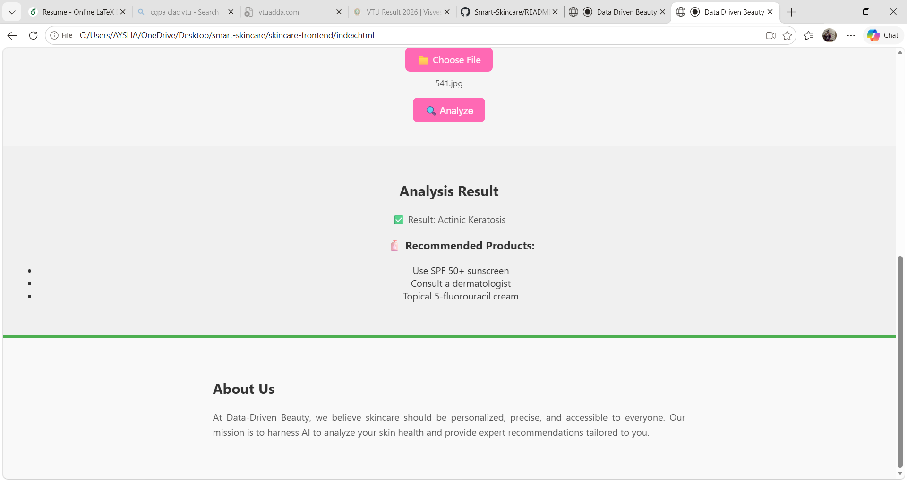

# Smart Skincare – AI-Powered Skin Analysis System

Smart Skincare is an AI-powered web application designed to analyze facial skin conditions using Deep Learning and Computer Vision techniques. Users can capture a live image through their webcam, and the system detects common skin concerns such as acne, wrinkles, and pigmentation while providing personalized skincare recommendations.

## 📌 Features

- 📷 Live webcam image capture
- 🤖 AI-based skin analysis
- 🔍 Detection of:
  - Acne
  - Wrinkles
  - Pigmentation
- 💡 Personalized skincare recommendations
- 🌐 Interactive and user-friendly web interface
- ⚡ Real-time image processing

## 🛠️ Technologies Used

### Frontend
- HTML5
- CSS3
- JavaScript

### Backend
- Python
- Flask

### Machine Learning & Computer Vision
- TensorFlow
- OpenCV
- NumPy
- Pandas
- Matplotlib

## 📂 Project Structure

```text
smart-skincare/
│
├── skincare-frontend/
│   ├── index.html
│   ├── style.css
│   └── script.js
│
├── skincare-backend/
│   ├── app.py
│   ├── train_model.py
│   ├── requirements.txt
│   ├── models/
│   ├── skin_dataset/
│   └── utils/
│       └── recommender.py
│
└── README.md
```

## 🚀 How It Works

1. User captures a facial image using the webcam.
2. The image is sent to the Flask backend.
3. The trained Deep Learning model processes the image.
4. Skin conditions are identified.
5. Personalized skincare recommendations are generated.
6. Results are displayed on the website.

## ⚙️ Installation

### Clone the Repository

```bash
git clone https://github.com/Ayshamahshoofa/Smart-Skincare.git
cd Smart-Skincare
```

### Create a Virtual Environment

```bash
python -m venv venv
```

### Activate the Virtual Environment

**Windows**

```bash
venv\Scripts\activate
```

**Linux / macOS**

```bash
source venv/bin/activate
```

### Install Dependencies

```bash
pip install -r skincare-backend/requirements.txt
```

## ▶️ Run the Application

### Start the Flask Server

```bash
cd skincare-backend
python app.py
```

### Open the Frontend

Open the `index.html` file in your browser.

## 📸 Screenshots

![splashscfreen].(assets/splashscreen.png)



## 📊 Future Enhancements

- Advanced skin condition detection
- User authentication and profiles
- Skin health tracking dashboard
- AI chatbot for skincare assistance
- Mobile application support
- Power BI analytics integration


```

